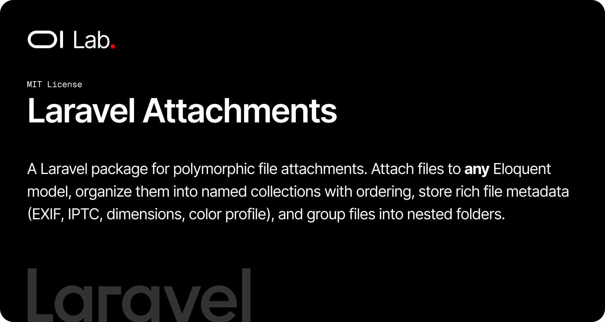

# OI Laravel Attachments BETA

[](https://packagist.org/packages/oi-lab/oi-laravel-attachments)
[](https://packagist.org/packages/oi-lab/oi-laravel-attachments)
[](https://github.com/oi-lab/oi-laravel-attachments/actions)
[](LICENSE)

A Laravel package for polymorphic file attachments. Attach files to **any** Eloquent model, organize them into named collections with ordering, store rich file metadata (EXIF, IPTC, dimensions, color profile), and group files into nested folders.

## Features

- **Polymorphic Attachments**: Attach files to any model via a single `HasAttachments` trait
- **Named Collections**: Group attachments per model (e.g. `gallery`, `cover`, `documents`)
- **Ordering**: First-class sort support with reorder, move, and swap helpers
- **Rich File Metadata**: `File` model captures mimetype, filesize, dimensions, MD5, EXIF, IPTC, and color info
- **Folders**: Optional self-nesting folder tree for organizing files
- **Upload Actions**: Single-call actions to store uploads and attach them to a model
- **Audit Tracking**: Automatic `created_by` / `updated_by` tracking on every record
- **Configurable Models**: Swap in your own `File`, `Folder`, or `Attachment` subclasses
- **Storage Agnostic**: Works with any Flysystem disk (local, S3, etc.)

## How It Works

The package revolves around three models:

- **File** — a stored file and its metadata, optionally living inside a `Folder`.
- **Folder** — a self-nesting container (`parent_id` tree) for organizing files.
- **Attachment** — a polymorphic pivot linking a `File` to any `attachable` model, with a `collection` name and `sort` order.

Host models opt in with the `HasAttachments` trait, which exposes the full attach / detach / sync / reorder API. All package internals resolve model classes through the `OiLaravelAttachments` resolver, so you can override any model from config without touching package code.

## Requirements

- PHP 8.2+
- Laravel 11.0+, 12.0+, or 13.0+

## Installation

```bash
composer require oi-lab/oi-laravel-attachments
```

The package auto-discovers and registers its service provider — no manual registration required.

### Local Development

For local development, add this to your main project's `composer.json`:

```json
{
    "repositories": [
        {
            "type": "path",
            "url": "./packages/oi-lab/oi-laravel-attachments"
        }
    ]
}
```

Then:

```bash
composer require oi-lab/oi-laravel-attachments
```

### Publish & Migrate

Publish the migrations (and optionally the config) and run them:

```bash
php artisan vendor:publish --tag=oi-laravel-attachments-migrations
php artisan vendor:publish --tag=oi-laravel-attachments-config
php artisan migrate
```

This creates the `folders`, `files`, and `attachments` tables.

## Configuration

The config file `config/oi-laravel-attachments.php` exposes the following options:

```php
return [
    // Model used for the created_by / updated_by audit relationships
    'user_model' => 'App\Models\User',

    // Model classes used by the package — override with your own subclasses
    'models' => [
        'file' => OiLab\OiLaravelAttachments\Models\File::class,
        'folder' => OiLab\OiLaravelAttachments\Models\Folder::class,
        'attachment' => OiLab\OiLaravelAttachments\Models\Attachment::class,
    ],

    // Disk used to store uploaded files (defaults to ATTACHMENTS_DISK, then FILESYSTEM_DISK)
    'disk' => env('ATTACHMENTS_DISK', env('FILESYSTEM_DISK', 'local')),

    // Directory uploaded files are stored under
    'directory' => 'uploads',
];
```

## Usage

### Make a Model Attachable

Add the `HasAttachments` trait to any model:

```php
use Illuminate\Database\Eloquent\Model;
use OiLab\OiLaravelAttachments\Concerns\HasAttachments;

class Product extends Model
{
    use HasAttachments;
}
```

### Attach & Detach Files

```php
// Attach a File (model instance or id) to a collection
$product->attachFile($file, collection: 'gallery');

// Detach
$product->detachFile($file, 'gallery');

// Read attachments (ordered by sort)
$product->attachments;                    // all attachments
$product->attachments('gallery')->get();  // one collection
$product->singleAttachment('cover');      // MorphOne for single-file collections

// Read the underlying File models directly
$product->attached_files;                 // Collection<File>
```

### Sync a Collection

`syncAttachments()` replaces every attachment in a collection. `syncAttachmentsIfChanged()` does the same but skips the database work when the ids and their order already match:

```php
$product->syncAttachments([$id1, $id2, $id3], 'gallery');

// Returns false and does nothing if the collection is already in this exact state
$changed = $product->syncAttachmentsIfChanged([$id1, $id2, $id3], 'gallery');
```

### Reorder

```php
// Map file ids to their new sort position
$product->reorderAttachments([
    $fileA->id => 0,
    $fileB->id => 1,
    $fileC->id => 2,
], 'gallery');
```

### Uploading Files

Use the action classes instead of building `File` records manually. `StoreUploadedFile` persists the upload and captures its metadata; `AttachUploadedFiles` stores many uploads and attaches them in a single call:

```php
use OiLab\OiLaravelAttachments\Actions\StoreUploadedFile;
use OiLab\OiLaravelAttachments\Actions\AttachUploadedFiles;

public function store(Request $request, Product $product): RedirectResponse
{
    // Store a single upload, get back a File model
    $file = StoreUploadedFile::handle($request->file('document'));

    // Store multiple uploads and attach them to the product
    AttachUploadedFiles::handle($product, $request->file('images'), 'gallery');

    return back();
}
```

### Working with Files

The `File` model offers type helpers, storage access, and a search scope:

```php
$file->isImage();   // mimetype starts with image/
$file->isVideo();
$file->isAudio();

$file->getFullPath();  // absolute path (local disks only)
$file->getStream();    // stream resource (works with S3 etc.)

File::search('invoice')->get(); // matches filename, title, or description
```

File metadata is exposed as a value object rather than raw JSON:

```php
$file->metadata->width;
$file->metadata->height;
$file->metadata->aspect_ratio;
$file->metadata->exif;        // ExifValueObject|null
$file->metadata->iptc;        // IptcValueObject|null
$file->metadata->resolution;  // ResolutionValueObject|null
```

### Folders

Files can optionally be organized into a nested folder tree:

```php
$folder = Folder::create(['name' => 'Invoices']);
$child = Folder::create(['name' => '2026', 'parent_id' => $folder->id]);

$folder->children;  // HasMany<Folder>
$folder->files;     // HasMany<File>
$child->parent;     // BelongsTo<Folder>
```

## Customizing Models

To extend a model, subclass the package model and point the config at your class. Always resolve model classes through the `OiLaravelAttachments` helper so your override is respected everywhere:

```php
use OiLab\OiLaravelAttachments\Models\File as BaseFile;

class File extends BaseFile
{
    // your customizations
}
```

```php
// config/oi-laravel-attachments.php
'models' => [
    'file' => App\Models\File::class,
],
```

## Events

Each action dispatches a Laravel event you can listen to. All events live in `OiLab\OiLaravelAttachments\Events`:

| Event | Dispatched when |
|-------|-----------------|
| `FileStored` | An uploaded file is stored by `StoreUploadedFile` |
| `FileAttached` | A file is attached to a model |
| `FileDetached` | One or more attachments are removed |
| `AttachmentsSynced` | A collection is replaced via `syncAttachments()` |
| `AttachmentsReordered` | Attachments are reordered |
| `AttachmentCreated` / `AttachmentUpdated` / `AttachmentDeleted` | Model-level attachment lifecycle |
| `FileCreated` / `FileUpdated` / `FileDeleted` | A file record is created, updated, or soft deleted |
| `FileMoved` | A file is moved to a different folder |
| `FileRestored` | A soft-deleted file is restored |
| `FolderCreated` / `FolderUpdated` / `FolderDeleted` | A folder is created, updated, or soft deleted |
| `FolderMoved` | A folder is moved to a different parent |
| `FolderRestored` | A soft-deleted folder is restored |

```php
use Illuminate\Support\Facades\Event;
use OiLab\OiLaravelAttachments\Events\FileStored;

Event::listen(function (FileStored $event) {
    if ($event->file->isImage()) {
        // generate thumbnails, optimize, ...
    }
});
```

See the [Events documentation](docs/advanced/events.md) for each event's payload and dispatch behaviour.

## Database Schema

| Table | Purpose |
|-------|---------|
| `folders` | Self-nesting folder tree (`parent_id`), soft-deletable |
| `files` | Stored files with metadata, optional `folder_id`, soft-deletable |
| `attachments` | Polymorphic pivot (`attachable`, `file_id`, `collection`, `sort`) |

All three tables carry a unique `uuid`, `created_by` / `updated_by` audit columns, and timestamps.

## Testing

This package ships **75 tests** covering the attachment trait, models and relationships, sorting, upload actions, file metadata, audit tracking, and events.

```bash
# Run all tests
vendor/bin/pest

# Run a specific suite
vendor/bin/pest tests/Unit
vendor/bin/pest tests/Feature

# With coverage
vendor/bin/pest --coverage
```

## AI Assistant Skills

This package ships a skill file that gives AI coding assistants (Claude Code, JetBrains Junie) context about how attachments work. Install it into your application with the Artisan command:

```bash
php artisan oi:skills
```

This writes `.claude/skills/oilab-laravel-attachments/SKILL.md` and `.junie/skills/oilab-laravel-attachments/SKILL.md`, and adds an `oi-lab/oi-laravel-attachments` rules section to your project's `CLAUDE.md`. See the [documentation](docs/advanced/skills.md) for details.

## Contributing

Contributions are welcome! When contributing:

1. Write tests for new features
2. Ensure all tests pass: `vendor/bin/pest`
3. Run `vendor/bin/pint` to match the project code style
4. Update documentation as needed

## License

This package is open-source software licensed under the [MIT license](LICENSE).

## Credits

**[Olivier Lacombe](https://www.olacombe.com)** - Creator and maintainer

Olivier is a Product & Technology Director based in Montpellier, France, with over 20 years of experience innovating in UX/UI and emerging technologies. He specializes in guiding enterprises toward cutting-edge digital solutions, combining user-centered design with continuous optimization and artificial intelligence integration.

**Projects & Resources:**
- [OI Dev Docs](https://dev.olacombe.com) - Documentation for all Open Source OI Lab packages
- [OnAI](https://onai.olacombe.com) - Training courses and masterclasses on generative AI for businesses
- [Promptr](https://promptr.olacombe.com) - Prompt engineering Management Platform

## Support

For support, please open an issue on the [GitHub repository](https://github.com/oi-lab/oi-laravel-attachments/issues).
